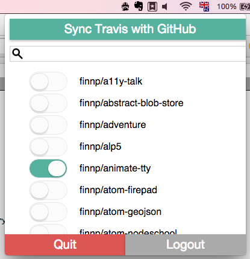

# travis-comrade 

Menubar application for synchronizing and activating GitHub repositories on [Travis](https://travis-ci.org).

To download the latest version visit the [releases page](https://github.com/finnp/travis-comrade/releases).

This project inofficial and not affiliated with Travis CI GmbH.
